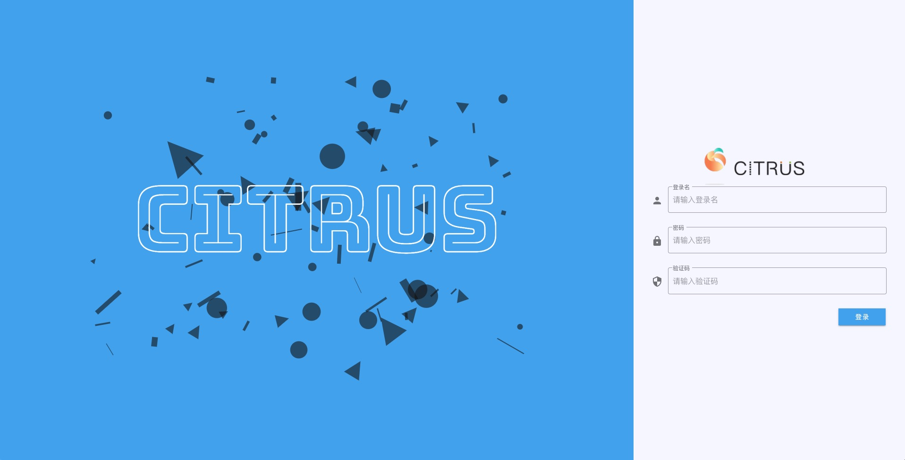

<p align="center">
  <a href="https://github.com/Yiuman/citrus">
   
  </a>
</p>

<h1 align="center">Citrus-Vuetify</h1>

### 项目简介
基于Vue+Vuetify的后台管理系统前端项目。提炼出了通用的业务组件模板，动态路由，可配合后台进行快速开发。

后端地址：https://github.com/Yiuman/citrus  

[LiveDemo](http://42.192.95.146:8088/#/login)  账号:admin 密码:123456 

> 如果此项目对你有帮助，请记得给我一个小星星:star:


### 技术栈

**前端技术栈**：Vue2.x + vuex + vue-router + webpack + ES6 + vuetify 

**后端技术栈**：Springboot + SpringSecurity + JWT + Mybatis-Plus


### 运行项目

因为此项目没有使用mock，所以也需要将后端项目clone下来，又或者你也是javaer，可以直接使用maven引入后端的starter使用

```sh
git clone https://github.com/Yiuman/citrus-vuetify.git

npm install

npm run serve
```


### 通用组件及业务组件

- 登录、注销
- 用户管理
- 组织机构管理
- 资源管理
- 菜单管理
- 权限管理
- 角色管理
- 个人中心
- 访问日志

除了上面已列出的相关功能，还封装了一些通用的业务组件，比如：

- 通用的表格组件（可根据接口数据进行表格的相关的渲染，如按钮控制，勾选控制等）
- 通用的树形组件（同上）
- 数据自渲染表单（可根据数据类型进行自动渲染表单）
- 图片上传裁切组件

...

基于此前端与后台，还实现了一个比较简单的门店管理项目，就是LIVEDEMO里的内容


### 项目截图





